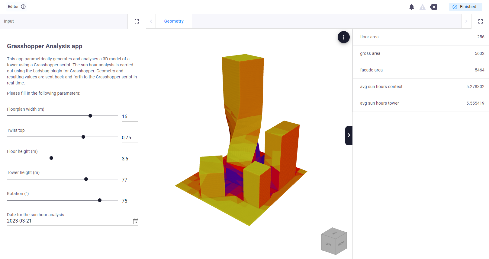
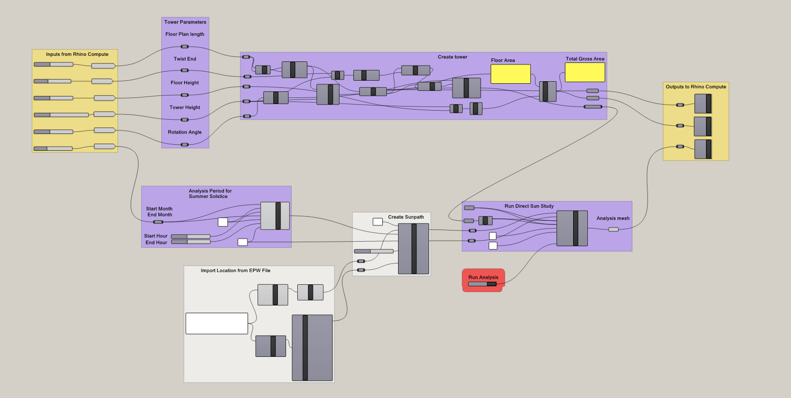

# Grasshopper analysis
A VIKTOR sample app which runs a Grasshopper script with Ladybug sunhours analysis. 🦗🐞

**Functionality**

This app demonstrates how to connect VIKTOR applications to Grasshopper scripts. The app is connected to a Rhino Grasshopper instance running on a server, and allows the user to run a Grasshopper script with a sunhours analysis. A twisting tower is configured through the app parameters, and each time the user updates a parameter, a Grasshopper script runs on the server that performs a sunhours analysis using the popular Ladybug plugin. The tower parameters can be adjusted and the resulting geometry and sunhour performance is visualized in real-time.

**Configuration**

The Grasshopper script that is executed and the worker configuration used for this app can be found in this repo under `files`. For further documentation on how install and connect Rhino / Grasshopper to your VIKTOR app, head to our [docs](https://docs.viktor.ai/docs/create-apps/software-integrations/rhino-grasshopper/).

**Use Cases of Grasshopper integration**

This integration opens the door to many exciting possibilities. It is possible to inject Grasshopper into existing VIKTOR workflows, run Grasshopper scripts using plug-ins from the browser or automate complex workflows with multiple Grasshopper files. Happy coding! 😊🎉
